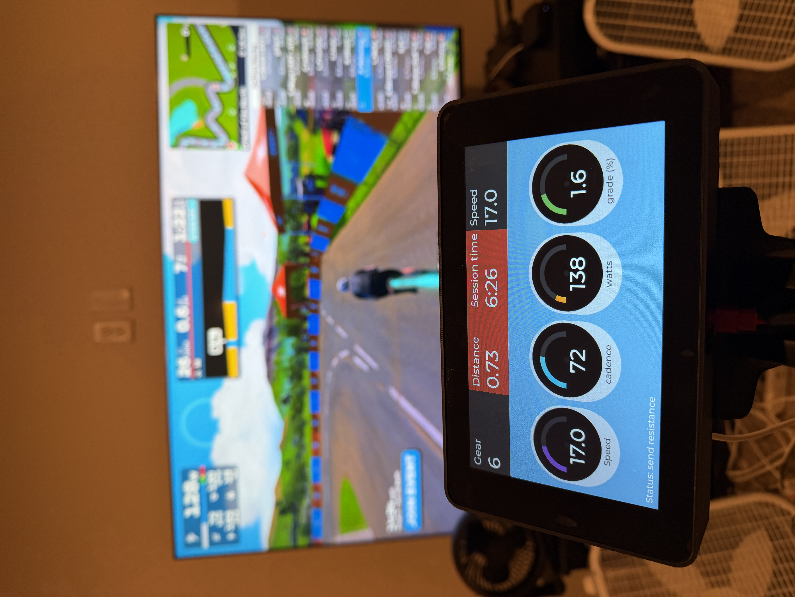

# ProForm TdF Pro 4.0 iFit to Waveshare BLE Conversion

This project replaces the original iFit-based display on a ProForm Tour de France Pro 4.0 bicycle trainer from approximately 2012-2016 with a modern ESP32-based controller and display. It converts the trainer from a proprietary Wi-Fi–dependent design into a native Bluetooth Low Energy (BLE) smart trainer which is directly compatible with modern training platforms.  It also resolves an issue where the built-in original Proform iFit display gets stuck in an endless boot-loop and the bike stops working because the display doesn't work any more.   

The system removes the need for Wi-Fi bridges to connect to online cycling apps like Zwift and Rouvy by advertising, receiving, and broadcasting BLE data directly. Training applications such as Zwift and Rouvy can control resistance and elevation while receiving power and cadence data in real time.   I have to add that I have always been grateful to the authors of the data bridges which I have used to connect my Proform TDF 4.0 Pro for years until recently when the Proform display interface stopped working.

---

## Background

The ProForm TdF Pro 4.0 relies on an embedded iFit display and a Wi-Fi communication model that is increasingly unreliable and unsupported. This project replaces the entire control and communication layer while retaining the original mechanical resistance hardware.

In December 2025, my Proform went into this endless boot loop and basically stopped working.  I didn't know what to do, so I looked at Kevin Mott's Proform BLE code, but he has an older Proform version and his didn't seem to work with mine because the RS-485 modbus frames didn't match.  I started changing his code, called mine v2, but I kept changing more and more and then I decided to add a display to it.   Finally I decided that other people might end up in the same situation as I was and I published what I did here.

If you bike display goes bad or stops connecting to WiFi or there is an issue with the iFit board, but not in the electronics near the pedals and you have a Proform TDF 4.0 Pro, then this project should help you.  If your Proform is not an exact match to my model it might work.  If you have a Proform 1.0 or 2.0, you should use Kevin Mott's Proform_BLE code (see the bottom of this).

The goal of this project is to extend the useful life of otherwise functional hardware and restore compatibility with current training software.  Specifically the goal is to replace the "ProForm TDF Pro 4.0 Bike 7" Display Touchscreen Console Assembly Ebpf01914" with a ~$50 "Waveshare ESP32-S3 7 LCD"

---

## Features

- Native BLE advertising and pairing
- Direct compatibility with Zwift and Rouvy
- Bidirectional control of resistance and simulated grade
- Real-time reporting of power and cadence
- Replacement of the original console with a Waveshare ESP32-S3 LCD
- Standalone operation without phone or bridge applications

---

## System Overview

- **Controller / Display**: Waveshare ESP32-S3 LCD
- **Communication**: Bluetooth Low Energy
- **Control Loop**:
  - BLE commands from training software drive resistance and elevation
  - Sensor data is processed and reported as power and cadence
- **Trainer Interface**:
  - Direct electrical interface to existing ProForm resistance hardware
  - No modification to the mechanical drivetrain

---

## Compatibility

### Hardware
- ProForm Tour de France Pro 4.0 from approximately 2012 to 2016
- may work with other Proform TdF models but I haven't tested

Note that the motor control to raise and lower the bicycle is not enabled by this code.  Honestly I found it a bit annoying to use for years - I bought the bike thinking it would be cool but after a decade of hearing the motor move the bike up and down, I decided I didn't need that feature any more.   If you really love the bike tilting, it shouldn't be THAT hard to enable it.   But I have it disabled.

### Compatible Software
- Zwift
- Rouvy
- MyWhoosh
- also works standalone without connecting to anything

Other BLE-capable training applications may work but have not been fully tested.

---

## Parts
- Waveshare ESP32-S3-Touch-LCD-7 - can be purchased at several places including directly from Waveshare and from Amazon. ~$50   https://www.waveshare.com/wiki/ESP32-S3-Touch-LCD-7
- 3D printed case - you can use this by Sergey Morozov https://www.printables.com/model/1030369-waveshare-esp32-s3-7inch-capacitive-touch-display but before I printed it, I streched the design up in the printer slicing to give it a bit more room for stashing wires.   If you use the 3D case you will need M3 screws to attach the screen to the case, although the Waveshare board has adhesive and might work well enough that screws aren't needed but I screwed mine with M3x30 screws.
- 4 short screws - I used #6 1/2" wood screws - to attach the 3D printed case to the Proform
- Long USB-C cable to power the Waveshare board
- USB-C charging block to power it.   It works fine with a 20W charger.

## Installation

Remove all of the philips head screws holding the original iFit display to the bike frame.   Take everything above the handlebars off and unplug the shifters and the RS-485 connector to the lower bicycle circuit board.  The just pull back the red connectors and then the other connector slides out.   It should look like this:

Optional but useful step, snip the cables for the shifter buttons and the RS-485 from the iFit console - this makes it easy to attach and remove the new board.

Connect the 4-wire RS-485 black, blue and green wires to the Waveshare RS-485 port which is midway down the right side on the Waveshare board looking from the back and is silkscreened "RS485".   
- Bike RS-485 blue wire goes to RS-485 black silkscreen label "A"
- Bike RS-485 green wire goes to RS-485 red silkscreen label "B"
- Bike RS-485 black wire goes to any Waveshare GND connection - you can use the GND on the I2C connector right next to the RS-485.  But any GND works.
- Bike RS-485 red wire is left unconnected - although you could use a 9V -> 5V buck converter to power the board from the lower bike circuit board.  But I'm powering it from USB-C.

For the shifters, if you want to use both left and right shifters (4 buttons) you will need to add an I2C GPIO expander.  I opted against this at this time and so I'm just using the right shifter.  These plug into the port labelled UART2 in the upper left corner of the board looking from the rear and is silkscreened "UART2".
- Right Shifter blue wire goes to UART2 white wire silkscreen label TXD
- Right Shifter green wire goes to UART2 yellow wire silkscreen label RXD
- Right Shifter yellow wire goes to UART2 black wire silkscreen label GND
UART2 3V3 - the red wire - is unconnected

That is all the wiring.   You don't *need* to solder them, you could strip them, twist them and cover them with shrink tape or electrical tape.  But ideally you want to solder them.

Move the two yellow jumpers for RS485 one notch over (see photo) to remove 120 ohm termination - not sure if it's absolutely needed but it seemed to help and that's how I have mine.  Also flip the switch on the bottom to move from USB to UART2 - this enables the UART2 that the shifter buttons are plugged into.

As noted in the parts list, you will want a case.  I 3D printed mine.  There are commercially available cases for this board.  You could also just mount it to wood.   But I think a 3D printed case looks and works the best.  For connecting the case to the bike, I used 4 wood screws.  But you could double-sided tape it, or hot glue gun it.  

You will then need to flash the ESP32S3.  This is likely to be the hard part if you are not familiar with flashing ESP32 devices.   

I have included a "factory-merged.bin" image which should flash without VS Code or Arduino IDE using esptool.
esptool.py --chip esp32s3 write_flash 0x0 ws_esp32s3_t_lcd7_firmware_factory-merged.bin

Or you can flash using the web interface on Adafruit's website:
https://adafruit.github.io/Adafruit_WebSerial_ESPTool/

To use the flashing capability on Adafruit's webserial ESPTool:
   Open the page on a Chrome/Edge/Chromium-based browser - it needs to be a browser that supports webserial
   Connect to the board.  Keep the speed at 115200.
   Click Choose a file… for one slot and select factory-merged.bin (downloaded from this github release).
   Set/verify the Offset is 0x0 (that’s what Adafruit’s own instructions call out).
  (Recommended) click Erase first 
   Click Program.

Lastly you could load the code up in VS Code using the included Github files.

## Future Improvements and known issues

The board sometimes reboots in offline mode when it's not connected to Zwift.  Most of the times it's totally stable.  I am not sure why it does this.  It's on the list to debug.
The speed and distance calculation is pretty far off from Zwift - this is sort of an unsolvable problem because I can't exactly replicate Zwift's calculation with bike  frames, wheels, drafting, etc.  but I could do better.  But this doesn't affect Zwift operation where the speed/distance are calculated by Zwift.  It's really more of an issue for offline use.   For riding at 0% grade, the calculation is close enough to work for now.  
The elevation/grade is frequently pretty far off.   The resistance and power are correct, but the grade is often 2x what it's supposed to be.  It's mostly just a visual problem (like the speed/distance).  Zwift knows what it is, and the power calcution seems correct.
I'd like to upgrade Offline mode to work better. 
I'd like to calibrate the power calculation with a power meter (but those are expensive!).  Right now it's roughly what feels right.

## Acknowledgements

This project was inspired by the work of @kevinmott09:
https://github.com/kevinmott09/proformBLE

While this implementation is a complete rewrite, the original project demonstrated that replacing the factory iFit console on the ProForm TdF platform was feasible and served as the initial inspiration and I used his reverse-engineering of the cadence and resistance values as well as the RS-485 connectivity as the basis for my code.  Without the example from @kevinmott09, there's a high probability my Proform TdF v4 Pro would be headed over to  metal scrap recycling.

The project is grateful to Dan Bee (TDF Data Bridge) and Roberto Viola (qdomyos-zwift) for their data bridge software which I have used for years.  Without them, I'd have sold or donated or scrapped the bicycle years ago.   With the access to the data bridges, I could ride in Zwift and that gave new life to the bike.

This project received advice and code from ChatGPT although it is my design and my project.

## Licence

This code and this entire project are licensed for non-commercial use under the PolyForm Noncommercial 1.0.0 license.  Users are free to modify, download, update the source but if you want to sell a device based on this code please contact Patrick Mahoney
