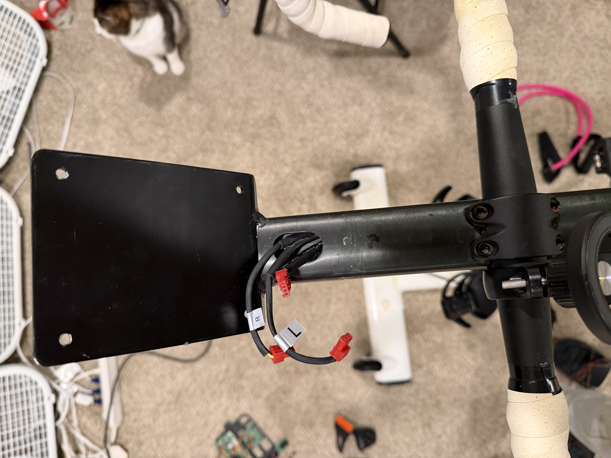
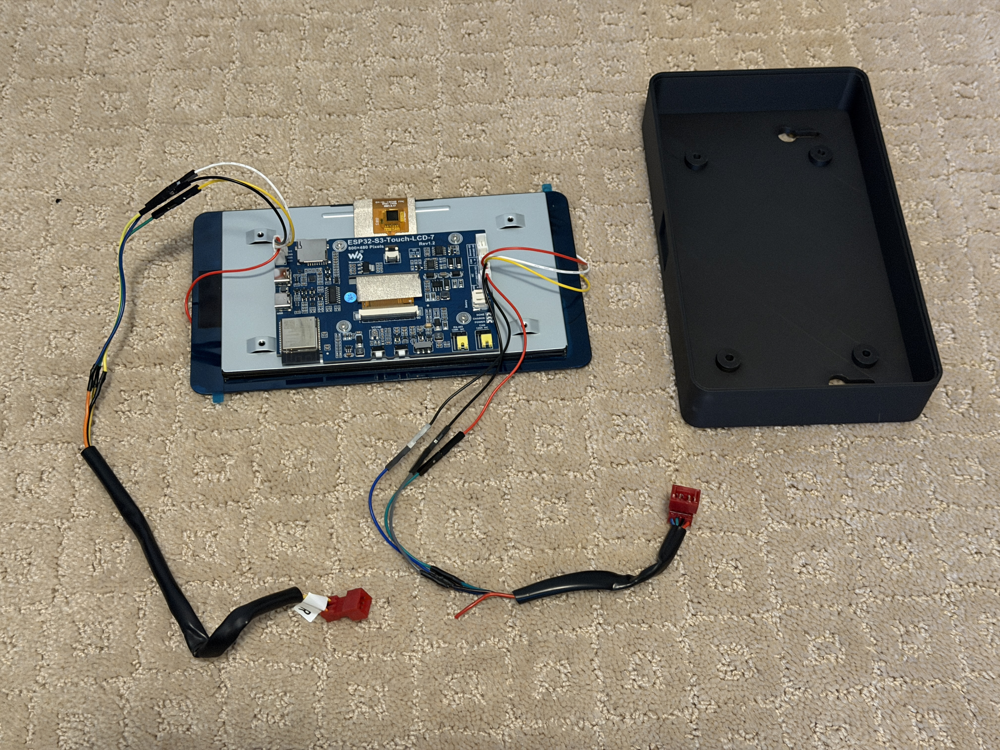
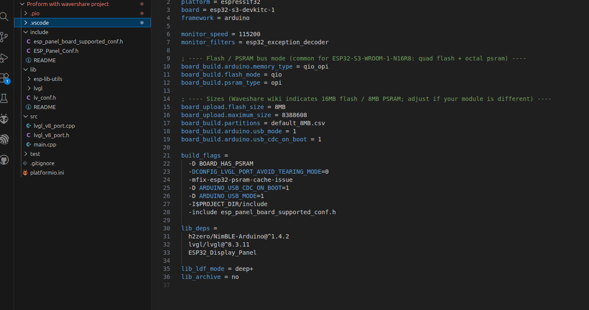

# ProForm TdF Pro 4.0 iFit to Waveshare BLE Conversion

This project replaces the original iFit-based display on a ProForm Tour de France Pro 4.0 bicycle trainer from approximately 2012-2016 with a modern ESP32-based controller and display. It converts the trainer from a proprietary Wi-Fi–dependent design into a native Bluetooth Low Energy (BLE) smart trainer which is directly compatible with modern training platforms.  It also resolves an issue where the built-in original Proform iFit display gets stuck in an endless boot-loop and the bike stops working because the display doesn't work any more.   

The system removes the need for QDOMYOS_ZWIFT or other Wi-Fi bridges to connect to online cycling apps like Zwift and Rouvy by advertising, receiving, and broadcasting BLE data directly. Training applications such as Zwift and Rouvy can control resistance and elevation while receiving power and cadence data in real time.

---

## Background

The ProForm TdF Pro 4.0 relies on an embedded iFit display and a Wi-Fi communication model that is increasingly unreliable and unsupported. This project replaces the entire control and communication layer while retaining the original mechanical resistance hardware.

The goal is to extend the useful life of otherwise functional hardware and restore compatibility with current training software.

Specifically the goal is to replace the "ProForm TDF Pro 4.0 Bike 7" Display Touchscreen Console Assembly Ebpf01914" with a ~$50 "Waveshare ESP32-S3 7 LCD"

---

## Features

- Native BLE advertising and pairing
- Direct compatibility with Zwift and Rouvy
- Bidirectional control of resistance and simulated grade
- Real-time reporting of power and cadence
- Replacement of the original console with a Waveshare ESP32-S3 LCD
- Standalone operation without phone or bridge applications

---

## System Overview

- **Controller / Display**: Waveshare ESP32-S3 LCD
- **Communication**: Bluetooth Low Energy
- **Control Loop**:
  - BLE commands from training software drive resistance and elevation
  - Sensor data is processed and reported as power and cadence
- **Trainer Interface**:
  - Direct electrical interface to existing ProForm resistance hardware
  - No modification to the mechanical drivetrain

---

## Compatibility

### Hardware
- ProForm Tour de France Pro 4.0 from approximately 2012 to 2016
- may work with other Proform TdF models but I haven't tested

Note that the motor control to raise and lower the bicycle is not enabled by this code.  Honestly I found it a bit annoying to use for years - I bought the bike thinking it would be cool but after a decade of hearing the motor move the bike up and down, I decided I didn't need that feature any more.   If you really love the bike tilting, it shouldn't be THAT hard to enable it.   But I have it disabled.

### Software
- Zwift
- Rouvy
- MyWhoosh

Other BLE-capable training applications may work but have not been fully tested.

---

## Parts
- ESP32-S3-Touch-LCD-7 - can be purchased at several places including directly from Waveshare. ~$50   https://www.waveshare.com/wiki/ESP32-S3-Touch-LCD-7
- 3D printed case - you can use this by Sergey Morozov https://www.printables.com/model/1030369-waveshare-esp32-s3-7inch-capacitive-touch-display or else use the .stl here which streches the design to give it a bit more room for stashing wires.   If you use the attached streched design you will need longer M3 screws to attach the screen to the case, although the Waveshare board has adhesive and might work well enough that screws aren't needed.

## Installation

Remove all of the philips head screws holding the original iFit display to the bike frame.   Take everything above the handlebars off and unplug the shifters and the RS-485 connector to the lower bicycle circuit board.  The just pull back the red connectors and then the other connector slides out.   It should look like this:

Optional but useful step, snip the cables for the shifter buttons and the RS-485 from the iFit console - this makes it easy to attach and remove the new board.

Connect the 4-wire RS-485 black, blue and green wires to the Waveshare RS-485 port which is midway down the right side on the Waveshare board looking from the back and is silkscreened "RS485".   
- Bike RS-485 blue wire goes to RS-485 black silkscreen label "A"
- Bike RS-485 green wire goes to RS-485 red silkscreen label "B"
- Bike RS-485 black wire goes to any Waveshare GND connection - you can use the GND on the I2C connector right next to the RS-485.  But any GND works.
- Bike RS-485 red wire is left unconnected - although you could use a 9V -> 5V buck converter to power the board from the lower bike circuit board.  But I'm powering it from USB-C.

For the shifters, if you want to use both left and right shifters (4 buttons) you will need to add an I2C GPIO expander.  I opted against this at this time and so I'm just using the right shifter.  These plug into the port labelled UART2 in the upper left corner of the board looking from the rear and is silkscreened "UART2".
- Right Shifter blue wire goes to UART1 white wire silkscreen label TXD
- Right Shifter green wire goes to UART1 yellow wire silkscreen label RXD
- Right Shifter yellow wire goes to UART1 black wire silkscreen label GND
UART1 3V3 - the red wire - is unconnected

That is all the wiring.   You don't *need* to solder them, you could strip them, twist them and cover them with shrink tape or electrical tape.  But ideally you want to solder them.

Move the two yellow jumpers for RS485 one notch over (see photo) to add termination - not sure if it's absolutely needed but it seemed to help and that's how I have mine..  Also flip the switch to move from USB to UART2 - this enables the UART that we plugged the shifter buttons into.

You will then need to flash the ESP32S3 via the USB connector labelled "USB" - make sure to plug into "USB" and not the other USB connector above it.  For Flashing, I used VSCode - although I acknowledge that VSCode is intimidating and maybe not the ideal choice if you aren't familiar with it.  I have used VS Code for years and I am still intimidated by it.  But you want to pull it up, create a project in ProjectIO as Arduino, put in the files in the directory structure above with the platformio.ini in the main directory, and and then flash it and build it.   You might be able to get this all working in much less intimidating Arduino IDE, but I use VSCode so I can't help.

The VSCode screen shout look like this:

## Acknowledgements

This project was inspired by the work of @kevinmott09:
https://github.com/kevinmott09/proformBLE

While this implementation is a complete rewrite, the original project demonstrated that replacing the factory iFit console on the ProForm TdF platform was feasible and served as the initial inspiration and I used his reverse-engineering of the cadence and resistance values as well as the RS-485 connectivity as the basis for my code.  Without the example from @kevinmott09, there's a high probability my Proform TdF v4 Pro would be headed over to  metal scrap recycling.

